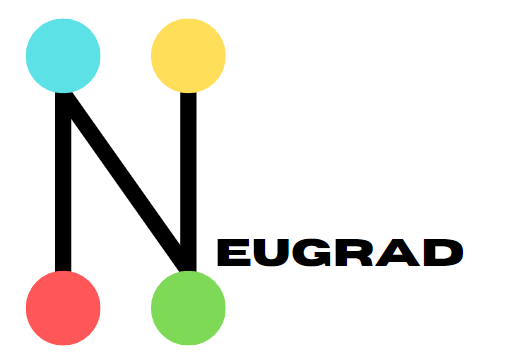

### Neugrad

This is a small autograd engine, made purely from numpy and python. This is still a work in progress and more features will be added with time
Hope you have fun implementing this :)
Additionally, later on, deep learning layer features, loss functions and optimizers will be added to this project.
This aims to be a small pytorch clone

## Requirements to run it

It would help if you had these installed in your system before running this engine
- Numpy
- Typing
- Python (version 3.7+)

## How to run it
- Download all the files (only engine.py)
- Use this syntax `from <file location of engine.py> import *` to import it into your code
- You can also see the tests I run on the engine in `test.py`

## Features added till now (with backpropagation)

`Scalar and Tensor Operations`
- Creation of Tensor (NVal)
- Addition
- Subtraction
- Negative of Tensor
- Tensor Power (Aᴮ) ~ B is a scalar
- Scalar Multiplication
- Scalar Division
- Max Function
- MatMul Function
- Transpose
- Mean
- Greater Than

`Helper Functions`
- Randn and Randn Like
- Rand
- Randint and Randint Like
- zeros and zeros like
- ones and ones like

`Converting Functions`
- to array
- to NVal
- to list
  
`Deep Learning Operations`
To Be Added

`Loss Functions and Optimizers`
To Be Added

# Active Bugs
- MatMul backprop

### Please keep in mind this is a work in progress and will keep on being updated over time.
